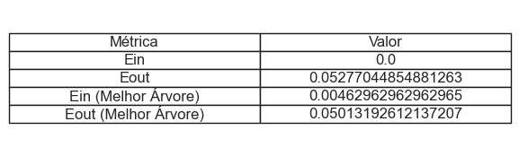

## Explicação do projeto

Dada a importância da água para a vida humana, este estudo foi desenvolvido com base em dados disponibilizados por órgãos governamentais e fontes como o IBGE, a ANA (Agência Nacional de Águas e Saneamento Básico) e o World Bank Group. Utilizando técnicas de Inteligência Artificial, o projeto visa prever o consumo de água no Brasil e no mundo nos próximos anos, levando em consideração ações humanas, condições ambientais, crescimento industrial, entre outros fatores. O objetivo principal é entender como determinados processos afetam o consumo de água e, a partir disso, propor medidas para minimizar o uso desse recurso finito, a água potável.

## Engenharia de Dados - Coleta, Descrição e Tratamento
### Fontes dos Dados:
World Bank Group: [Link](https://data.worldbank.org)

Após a análise de diversas fontes governamentais e internacionais, foi constatado que a API do World Bank Group oferece dados bem estruturados e confiáveis, com poucos "furos". Por isso, decidimos utilizá-la como base de dados para este projeto. Algumas adaptações foram feitas para tentar organizar os dados e torna-los melhores para utilização. Esses processos estão descritos no primeiro tópico do arquivo **codes.ipynb**.

### Crescimento Populacional
Os dados sobre o crescimento populacional são essenciais para compreender a relação entre o aumento da população e o consumo de água ao longo dos anos.

### Crescimento Industrial
Analisar o crescimento industrial é crucial, pois o desenvolvimento econômico costuma aumentar o consumo de água, especialmente em setores como agricultura, manufatura e energia.

### Área Florestal
Os dados sobre a preservação de florestas e áreas verdes são importantes para entender o quanto os países estão preocupados com a conservação de seus recursos naturais e como isso impacta o consumo de água.

### Consumo de Água - Target
O consumo de água se refere à quantidade retirada das reservas naturais. A água potável é um recurso limitado, e entender como seu uso evoluiu ao longo dos anos nos ajuda a planejar ações para enfrentar um futuro de potencial escassez.

### Rede neural:

Escolhi o número de camadas igual a um, pois como se trata de uma classificação simples não achei necessário torna mais complexo. A Heuristica apresentada para calcular o número de neurônios é: $$ n \leq \frac{|DS - 10|}{|10 \cdot (d + 2)|} $$
Sabendo que DS é o tamanho da amostra = 1891 e d é a dimensão de x = 3, temos: $ n \leq 37 $ , optei por 32, porque normalmente é o padrão.

#### Resultados:

### Árvore de decisão
O código implementa uma árvore de decisão para classificação, começando pela divisão dos dados em conjuntos de treino e teste. Em seguida, uma árvore de decisão simples é treinada nos dados de treino. Para evitar overfitting, é utilizada a técnica de poda conhecida como **Minimal Cost-Complexity Pruning**, que ajusta a árvore para minimizar a complexidade enquanto mantém a acurácia. O código testa diferentes valores de alpha, que controlam a quantidade de poda aplicada, e avalia a acurácia de cada modelo resultante através de validação cruzada. O melhor modelo é selecionado com base na menor complexidade que ainda oferece alta acurácia no conjunto de validação, garantindo um bom desempenho em dados não vistos.
#### Resultados

### SVM
O código implementa um modelo de **Máquina de Vetores de Suporte (SVM)** para classificação em um problema multiclasse. Primeiramente, os dados são divididos em conjuntos de treinamento e teste, garantindo que as classes estejam balanceadas. Em seguida, a técnica **SMOTE** (Synthetic Minority Over-sampling Technique) é utilizada para aumentar a quantidade de exemplos nas classes minoritárias, equilibrando assim os dados de treinamento.

O modelo SVM é configurado dentro de um classificador **OneVsRest**, que permite a classificação multiclasse, tratando cada classe como um problema binário. Os parâmetros do modelo, como `C` e `gamma`, são otimizados utilizando a técnica de **GridSearchCV**, que testa diferentes combinações de hiperparâmetros e avalia o desempenho usando validação cruzada com a métrica `f1_macro`.

Após encontrar os melhores parâmetros, o modelo é treinado com os dados reamostrados e utilizado para prever os rótulos no conjunto de teste. Por fim, um relatório de classificação é gerado para avaliar a precisão do modelo, e uma matriz de confusão é plotada para visualizar o desempenho em cada classe.

#### Resultados

